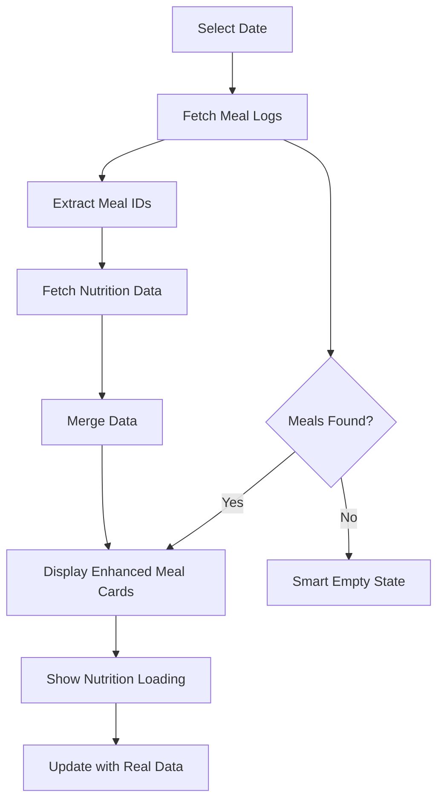

# Enhanced Meal Details Feature

## Overview
This feature provides comprehensive meal details display when meals are logged for specific dates and meal types, replacing the simple "No meals logged" message with rich, detailed meal information including real-time nutrition data.

## What's New

### 🎯 **Problem Solved**
- **Before**: Users saw "No meals logged for breakfast" even when nutrition data existed for that date
- **After**: Rich meal details with comprehensive nutrition information when meals exist

### ✨ **Key Features**

#### 1. **Enhanced Meal Cards**
- **Improved Design**: Larger, more visually appealing meal cards with hover effects
- **Meal Type Headers**: Clear meal type display (Breakfast, Lunch, Dinner, Snacks)
- **Timestamp Display**: Formatted date and time when meal was logged

#### 2. **Real-Time Nutrition Integration**
- **API Integration**: Uses the nutrition API to fetch detailed nutrition data
- **Live Data**: Shows protein, carbs, fat, and calories with real-time updates
- **Loading States**: Displays loading indicators while fetching nutrition data
- **Fallback Data**: Uses basic meal data if detailed nutrition isn't available

#### 3. **Detailed Food Item Display**
- **Item Count**: Shows total number of food items in each meal
- **Individual Items**: Lists each food item with quantity and weight
- **Calorie Information**: Displays calories per food item when available
- **Enhanced Layout**: Better organized with clear visual hierarchy

#### 4. **Smart Empty States**
- **Debugging Info**: Development mode shows debug information
- **Visual Icons**: Friendly icons for empty states
- **Context-Aware Messages**: Different messages for search vs. no meals
- **Quick Actions**: Easy access to add meal forms

#### 5. **Data Management**
- **Refresh Functionality**: Manual refresh button for troubleshooting
- **Auto-Loading**: Automatic data refresh when dates change
- **Error Handling**: Graceful error states with retry options
- **Debug Logging**: Comprehensive logging for troubleshooting

## Technical Implementation

### Data Flow


### Key Components Updated

#### 1. **Meal Page (`app/meal/page.tsx`)**
```typescript
// Enhanced nutrition integration
const { nutritionMap, loading: nutritionLoading2, getNutritionForMeal } = useMultipleMealNutrition(mealLogIds)

// Rich meal display with nutrition
const nutrition = getNutritionForMeal(meal.id);
```

#### 2. **Nutrition Hook Integration**
- Uses `useMultipleMealNutrition` for efficient parallel API calls
- Real-time nutrition data for each meal
- Loading states and error handling

#### 3. **Enhanced UI Components**
- Color-coded nutrition display (calories=blue, protein=green, carbs=orange, fat=purple)
- Responsive grid layouts
- Improved spacing and typography

### API Integration Points

#### Nutrition API
- **Endpoint**: `/api/nutrition/meal/{mealLogId}`
- **Usage**: Fetches detailed macro and micro nutrition data
- **Fallback**: Uses basic meal data if nutrition API fails

#### Meal Logs API  
- **Endpoint**: `/api/meal-logs/user/date/{date}`
- **Usage**: Fetches all meals for a specific date
- **Enhancement**: Better error handling and loading states

## User Experience Improvements

### 🎨 **Visual Enhancements**
1. **Nutrition Overview Cards**: Quick glance at macros with color coding
2. **Food Item Cards**: Individual cards for each food item with details
3. **Loading Animations**: Smooth loading indicators during data fetch
4. **Hover Effects**: Interactive cards with subtle animations

### 🔧 **Functionality Improvements**
1. **Refresh Button**: Manual refresh for troubleshooting data issues
2. **Debug Information**: Development mode shows helpful debug data
3. **Smart Loading**: Combines meal and nutrition loading states
4. **Error Recovery**: Graceful handling of API failures

### 📱 **Better Information Architecture**
1. **Hierarchical Display**: Clear organization from meal → items → nutrition
2. **Context-Aware Messaging**: Messages adapt to search/filter states
3. **Progressive Enhancement**: Works with basic data, enhanced with nutrition API

## Debugging Features

### Development Mode Enhancements
```typescript
// Debug information in empty states
{process.env.NODE_ENV === 'development' && (
  <div className="text-xs text-muted-foreground mb-4 p-2 bg-muted rounded">
    <p>Debug: Total meals loaded: {totalMealsCount}</p>
    <p>Available meal types: {allMealTypes.join(', ') || 'None'}</p>
    <p>Date: {selectedDate.toISOString().split('T')[0]}</p>
  </div>
)}
```

### Console Logging
- Date selection logging
- API call tracking
- Empty state analysis
- Nutrition data loading status

## Usage Examples

### For Users
1. **Select Date**: Use calendar to pick any date
2. **View Meals**: See detailed meal information if meals exist
3. **Check Nutrition**: Real-time nutrition data for each meal
4. **Refresh Data**: Use refresh button if data seems outdated

### For Developers
1. **Debug Empty States**: Check console for debug information
2. **API Testing**: Use built-in test buttons in development mode
3. **Data Validation**: Verify meal logs vs nutrition data consistency

## Benefits

### 🚀 **Performance**
- Parallel API calls for multiple meals
- Efficient data loading with proper loading states
- Minimal re-renders with optimized hooks

### 🎯 **User Experience**  
- Rich, informative meal displays
- Clear feedback on data loading
- Easy troubleshooting with refresh options

### 🔧 **Developer Experience**
- Comprehensive debugging tools
- Clear error messages
- Well-structured code with proper separation of concerns

## Future Enhancements

1. **Caching**: Implement nutrition data caching
2. **Offline Support**: Cache meal data for offline viewing
3. **Export Features**: Allow exporting meal details
4. **Meal Templates**: Save frequently used meals as templates
5. **Social Features**: Share meal details with others
6. **Analytics**: Track nutrition patterns over time

## Testing

To test this feature:

1. **With Meals**: Select a date with existing meals to see rich details
2. **Without Meals**: Select a date with no meals to see smart empty state
3. **Nutrition Loading**: Observe loading states for nutrition data
4. **Error Handling**: Test with network issues to see error recovery
5. **Refresh**: Use refresh button to reload data
6. **Debug Mode**: Run in development to see debug information 